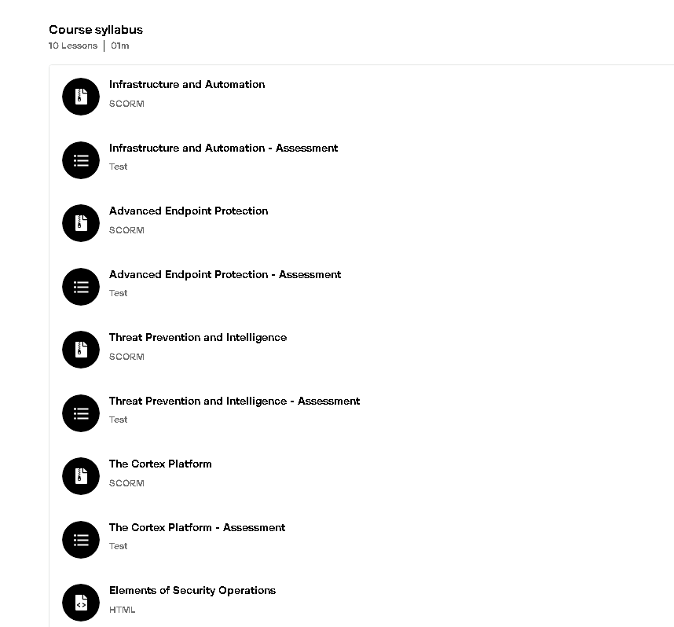

# 🛡️ Security Operations Fundamentals (Palo Alto)

This repository contains **notes, labs, playbooks, research case studies, and certificate of completion** for the *Security Operations Fundamentals (Palo Alto)* program. The course provides a solid foundation in **SOC operations, threat detection, incident response, and monitoring best practices**.

---

## 📚 Notes
- 📄 [01-introduction-to-soc.md](./notes/01-introduction-to-soc.md) – Introduction to SOC
- 📄 [02-security-monitoring-basics.md](./notes/02-security-monitoring-basics.md) – Security monitoring fundamentals
- 📄 [03-log-analysis-and-siem.md](./notes/03-log-analysis-and-siem.md) – Log analysis & SIEM overview
- 📄 [04-network-security-monitoring.md](./notes/04-network-security-monitoring.md) – Network monitoring essentials
- 📄 [05-incident-response-fundamentals.md](./notes/05-incident-response-fundamentals.md) – Incident response in SOC
- 📄 [06-threat-intelligence-basics.md](./notes/06-threat-intelligence-basics.md) – Threat intelligence fundamentals
- 📄 [07-soc-maturity-and-operations.md](./notes/07-soc-maturity-and-operations.md) – SOC maturity & operational practices

---

## 🧪 Labs
- 🔍 [content/playbooks/detection-engineering.md](./content/playbooks/detection-engineering.md) – Detection engineering lab
- ✅ [checklists/soc-readiness-checklist.md](./checklists/soc-readiness-checklist.md) – SOC readiness evaluation

---

## 📋 Playbooks
- 📄 [playbooks/common-playbooks.md](./playbooks/common-playbooks.md) – Common SOC playbooks
- ⚔️ [red-team/adversary-emulation-notes.md](./red-team/adversary-emulation-notes.md) – Red Team & adversary emulation notes

---

## 🔬 Research
- 📑 [extras/case-studies.md](./extras/case-studies.md) – Analyzed case studies
- 📆 [extras/timeline.md](./extras/timeline.md) – Timeline of attacks & responses

---

## 📖 Docs
- 📘 [docs/glossary.md](./docs/glossary.md) – SOC & cybersecurity glossary
- 📘 [docs/index.md](./docs/index.md) – Program overview
- 📘 [docs/references.md](./docs/references.md) – References & external sources
- 📘 [docs/roadmap.md](./docs/roadmap.md) – Learning roadmap
- 📘 [docs/syllabus.md](./docs/syllabus.md) – Course syllabus
- 📘 [extras/resources.md](./extras/resources.md) – Additional resources

---

## 📸 Screenshots

| Step | Screenshot |
|-------------------------|------------|
| 🏫 Course Description |  |
| ⭐ Course Interface |  |

---

## 📜 Certificate
🎓 [Security Operations Fundamentals (Palo Alto)](./cert/Security%20Operations%20Fundamentals%20Paloalto.png)

---

## 📝 Personal Review
This course strengthened my **blue-team and SOC knowledge**. The hands-on labs in **detection engineering, log analysis, and incident response** provided practical skills for monitoring and responding to threats. The program offers a comprehensive introduction for anyone looking to **build expertise in security operations and SOC practices**.

---

## ✍️ Author
**Thành Danh** – Red Team Learner & Security Researcher  

- GitHub: [@ngvuthdanhh](https://github.com/ngvuthdanhh)  
- Email: ngvu.thdanh@gmail.com  

---

## 📄 License
This project is licensed under the terms of the **MIT License**. See [LICENSE](./LICENSE) for full details.  
© 2025 ngvuthdanhh. All rights reserved.
